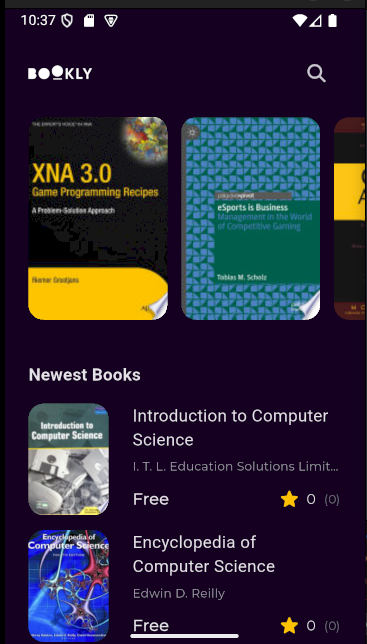

# Bookly App - A Flutter-Based Book Discovery App 📚✨


## 🎥 App Showcase

### 🎮 Video Demonstration
[🎥 Watch App Demo](https://drive.google.com/file/d/1uyLTBWTL45-osJlSXxGB_5PRnRenOB5d/view?usp=sharing)

### 📱 Screenshots
<p align="center">
  
  
  
  
</p>

##  Project Overview

Bookly is a Flutter-based book discovery app designed to help users explore and find free books. The app integrates with the Google Books API to fetch book details, including titles, authors, descriptions, and cover images. It features a clean and modern UI, state management using Cubit, and follows Clean Architecture principles for maintainability and scalability.

### 🔑 Key Highlights
- 📚 **Book Discovery**: Browse featured and newest books.
- 🔍 **Search Functionality**: Search for books by title or author.
- 📖 **Book Details**: View detailed information about each book, including descriptions, ratings, and preview links.
- 🌐 **Real-Time API Integration**: Fetches live book data from the Google Books API.
- 💡 **MVVM Pattern & Code**: Follows best practices for maintainability and scalability.

## 🛋️ Technical Specifications

| Aspect | Details |
|--------|---------|
| **Framework** | Flutter |
| **State Management** | Cubit |
| **Architecture** | Clean Architecture (MVVM) |
| **API Handling** | Dio |
| **Book Data Source** | [Google Books API](https://developers.google.com/books) |
| **Navigation** | GoRouter |

## ✨ Features

- 📚 **Featured Books**: Discover curated books on the home screen.
- 🔍 **Search Books**: Search for books by title or author.
- 📖 **Book Details**: View detailed information about a book, including its description, authors, and preview link.
- 🌐 **Real-Time Data**: Fetch live book data from the Google Books API.
- 📱 **Responsive UI**: Beautiful and intuitive user interface optimized for mobile devices.

## 🛠️ Getting Started

### Prerequisites
- Flutter SDK
- Dart SDK
- Android Studio or VS Code

### Installation
1. Clone the repository
```bash
git clone https://github.com/Maheresio/Bookly-App.git
```

2. Install dependencies
```bash
flutter pub get
```

3. Run the app
```bash
flutter run
```

## 🤝 Technology Stack & Dependencies
- **Flutter**
- **Dart**
- **Cubit (State Management)**
- **Dio (API Handling)**
- **GoRouter (Navigation)**
- **GetIt (Dependency Injection)**
- **Cached Network Image (Image Loading)**
- **Equatable (Value Equality)**
- **Google Fonts (Custom Fonts)**
- **Font Awesome Icons (Icons)**

## 🤝 About the Developer
This project was developed by **Ahmed Maher**, a passionate Flutter developer with expertise in  mobile applications. Bookly demonstrates skills in:
- API integration
- Clean Architecture & MVVM
- State Management with Cubit
- Clean Code & Best Practices
- UI/UX Optimization

## 🎨 Design Inspiration
- UI/UX Design: Custom-built with modern and minimal aesthetics.
- https://drive.google.com/file/d/1Y-noGizbczmGe2qEiZ4z9PDyIOoy1csS/view?usp=sharing

## 💪 Acknowledgments
- Flutter Team
- Dio Package Maintainers
- [Google Books API](https://developers.google.com/books)
- Contributors & Open-Source Community

## 🙏 Contributing
Contributions, issues, and feature requests are welcome! Feel free to check the [issues page](https://github.com/ahmed-gamal517/bookly-app/issues).

---
